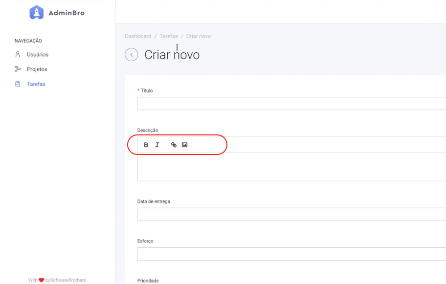
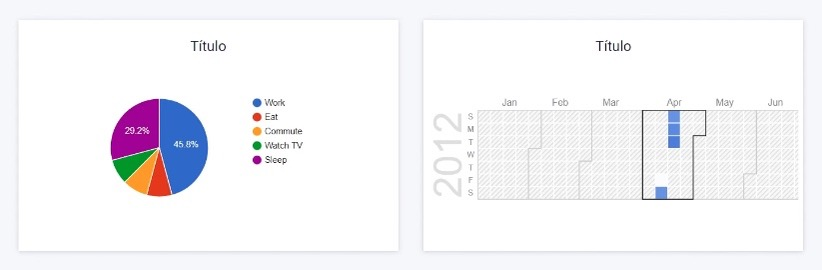
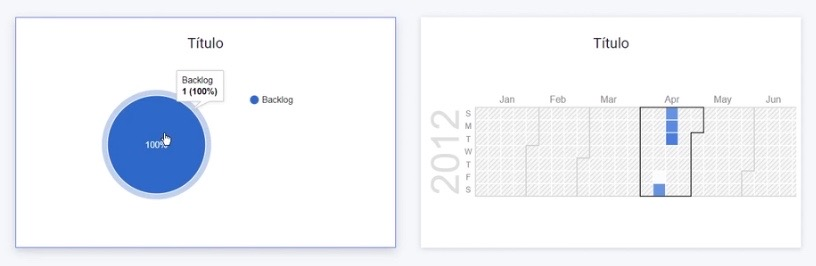

# Admin Manager

Este projeto consiste no desenvolvimento de uma aplicação para gerenciamento de projetos.
Ele foi desenvolvido a partir do **AdminJS**, porém com as customizações necessárias, como a tradução dos painéis para PT-BR, adição de gráficos e gerenciamento de permissões para diferentes níveis hierárquicos dentro do projeto. Ele foi estruturado tendo como parâmetro 3 diferentes tipos de níveis, onde:
- O administrador tem permissão em todos os níveis, desde a criação de tarefas quanto a vizualização dos usuários;
- O gerente tem acesso as tarefas e criação, mas não a vizualização dos usuários;
- O desenvolvedor só possui acesso as tarefas.

Para a criação de uma nova tarefa, eu implementei um editor "rico", onde o admin ou o manager consegue deixar o texto em **negrito**, *itálico*, adicionar link e inserir imagens para uma descrição mais detalhada da tarefa. Abaixo está a imagem de como ficou.

Além disso, como o AdminJS tem uma interface desenvolvida em React, eu implementei dois gráficos. O primeiro mostra a quantidade de projetos de cada status (Ex: 2 projetos 'backlog' - 1 projeto 'done' - 5 projetos 'approved'), estilizados em um gráfico do tipo Pizza.
O segundo gráfico mostra os dias do ano com marcação de cada mês (Gráfico tipo calendário) e o esforço gasto em cada projeto.
Abaixo estão duas imagens, a primeira é a implementação dele e a segunda já está integrada com os dados da aplicação.

Ambos os gráficos são da Google Charts.

Toda a tradução da plataforma para o português-BR está na pasta 'locales'.

## Tecnologias utilizadas

Para desenvolver esta aplicação em JavaScript, foram utilizadas as seguintes tecnologias:

- AdminJS (Base de todo o projeto);
- Node.JS (Back-end);
- React (Front-end);
- PostgreSQL (Banco de Dados);
- Docker;
- Sequelize (ORM);
- Express (Rotas);
- Sucrase e Nodemon (ES6 e auto reload);
- Dotenv (Tratamento de dados sensíveis);
- Lodash (Para manipulação dos Arrays e objetos);
- Bcrypt (Criptografia de senhas);
- React Google Charts (Gráficos em React).